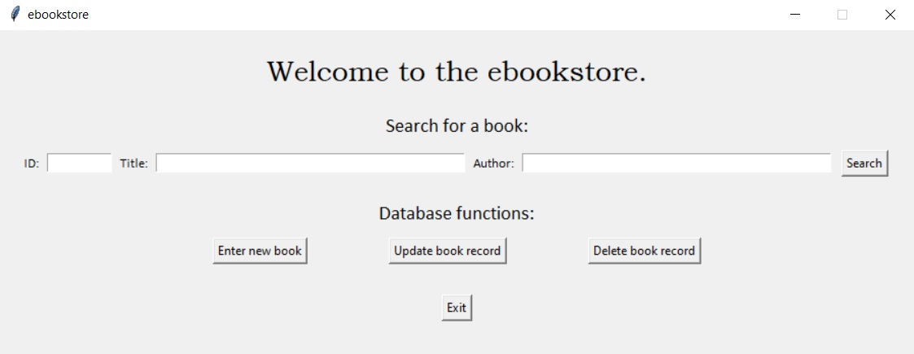

# A GUI representation of a digital bookstore using a SQLite database.

This application allows the user to add, update and delete books for quick reference as if they were running a mini-bookstore or library. Sort of like a digital inventory list.

The data is stored in the **ebookstore.db** file.

When launching **ebookstore.py**, you should see the following UI:

Click *Search* to view the books in the database. Alternatively, enter information in the search fields before clicking Search to search for a particular book, title or author.

Click *Enter new book* to add a new book to the database. No fields can be left blank when adding a book.
Click *Update book record* to change information such as the quantity available of a certain book. The ID cannot be changed.
Click *Delete book record* to remove a book from the store.

Click *Exit* to close the application UI.

The application was developed with Python 3 and requires the following site-packages:
- sqlite3
- tkinter

Use `pip install [package-name]` in the command terminal to install python packages.
